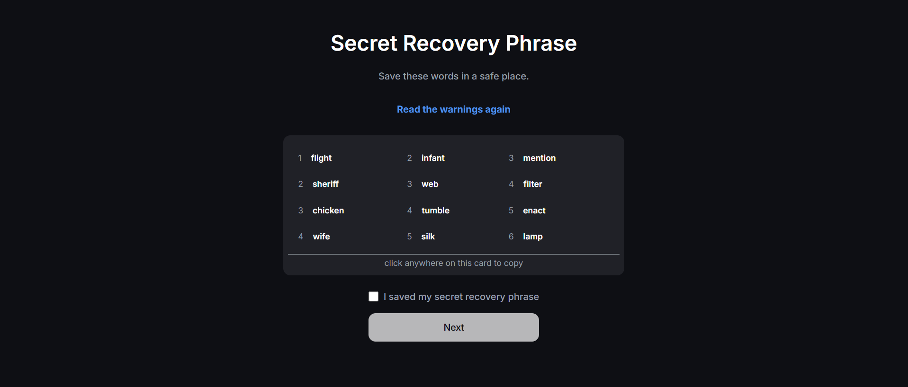

# Web3 Wallet

A Web3 based wallet similar to backpack but as a website .
We only support Solana Devnet blockchain

It has multiple features -
  1 - Create multiple public/private key for a single account
  2 - Send Money on solana blockchain
  3 - Receive money on solana blockchain

## Homepage
  It has a create wallet and import wallet button similar to backpack 


## Mneumonic


## SignIn
Seprate Signin Page


## Web3 Cohort

Here is some information about the project

[Dailycode](https://projects.100xdevs.com/tracks/public-private-keys/Public-Key-Cryptography-1)


## Tech Stack

**Client:** Nextjs, Recoil, TailwindCSS,

**Server:** Nextjs, Postgres, bip39, Solana


## Run Locally

Clone the project

```bash
  git clone https://github.com/akashbhardwaj23/web3-wallet
```

Install dependencies

```bash
  npm install
```

Start the server

```bash
  npm run start
```
or

```
    npm run dev
```

## Feedback

If you have any feedback, please reach out to us at akashbhardwaj415@gmail.com

## And Thats Happy Hacking

## Licence :
### [MIT](https://github.com/expressjs/express/blob/master/LICENSE)